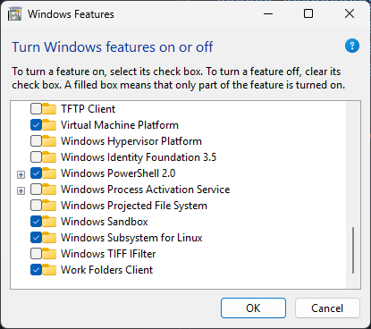

# Note

```bash
⣿⣿⣿⠟⠛⠛⠻⣿⣿⣿⣿⣿⣿⣿⣿⣿⣿⡟⢋⣩⣉⢻⣿⣿⣿
⣿⣿⣿⠀⣿⣶⣕⣈⠹⠿⠿⠿⠿⠟⠛⣛⢋⣰⠣⣿⣿⠀⣿⣿⣿
⣿⣿⣿⡀⣿⣿⣿⣧⢻⣿⣶⣷⣿⣿⣿⣿⣿⣿⠿⠶⡝⠀⣿⣿⣿
⣿⣿⣿⣷⠘⣿⣿⣿⢏⣿⣿⣋⣀⣈⣻⣿⣿⣷⣤⣤⣿⡐⢿⣿⣿
⣿⣿⣿⣿⣆⢩⣝⣫⣾⣿⣿⣿⣿⡟⠿⠿⠦⠀⠸⠿⣻⣿⡄⢻⣿
⣿⣿⣿⣿⣿⡄⢻⣿⣿⣿⣿⣿⣿⣿⣿⣶⣶⣾⣿⣿⣿⣿⠇⣼⣿
⣿⣿⣿⣿⣿⣿⡄⢿⣿⣿⣿⣿⣿⣿⣿⣿⣿⣿⣿⣿⣿⡟⣰⣿⣿
⣿⣿⣿⣿⣿⣿⠇⣼⣿⣿⣿⣿⣿⣿⣿⣿⣿⣿⣿⣿⣿⢀⣿⣿⣿
⣿⣿⣿⣿⣿⠏⢰⣿⣿⣿⣿⣿⣿⣿⣿⣿⣿⣿⣿⣿⣿⢸⣿⣿⣿
⣿⣿⣿⣿⠟⣰⣿⣿⣿⣿⣿⣿⣿⣿⣿⣿⣿⣿⣿⣿⣿⠀⣿⣿⣿
⣿⣿⣿⠋⣴⣿⣿⣿⣿⣿⣿⣿⣿⣿⣿⣿⣿⣿⣿⣿⣿⡄⣿⣿⣿
⣿⣿⠋⣼⣿⣿⣿⣿⣿⣿⣿⣿⣿⣿⣿⣿⣿⣿⣿⣿⣿⡇⢸⣿⣿
```

## MSI Center Pro

- Download here: [MSI Center Pro](https://apps.microsoft.com/detail/9nq4lgt81kgc)

## PC Manager

- Download here: [PC Manager](https://pcmanager.microsoft.com/)

## Davinci Resolve

- Download here: [Davinci Resolve](https://www.blackmagicdesign.com/products/davinciresolve/)

## Visual Studio

- Download here: [Visual Studio](https://visualstudio.microsoft.com/)

## Docker

- Step 1: Download Docker Desktop here: [Docker Desktop](https://www.docker.com/)

- Step 2: Enable `Windows Subsystem for Linux` feature.

  

- Step 3: Restart Windows for applying changes.

- Step 4: Install Docker Desktop via Windows Command Prompt (not PowerShell):

  ```
  start /w "" "Docker Desktop Installer.exe" install --backend=wsl-2 --installation-dir=<path-1> --wsl-default-data-root=<path-2>
  ```

  - `<path-1>`: The installation directory of Docker Desktop.
  - `<path-2>`: The folder where contain a Linux VM that run Docker Engine.
